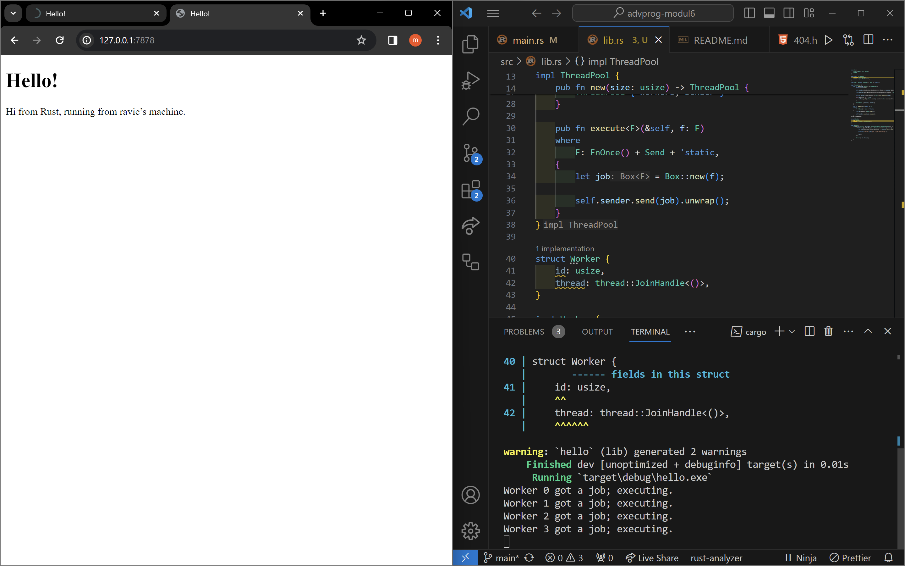

Advanced Programming A - Ravie Hasan Abud

1. Commit 1 (Handle-connection, check response) Reflection Notes

Pada method main, TcpListener akan keep track connection pada 127.0.0.1:7878. Setelah itu, akan unwrap setiap stream (connection yang diterima oleh TcpListener). Kemudian, stream tersebut akan dijadikan parameter fungsi handle_connection untuk diproses. Pada method handle_connection, instance BufReader digunakan untuk efisiensi dalam membaca setiap line. Hal ini karena BufReader akan melakukan splitting pada stream of data setiap kali ditemukan line baru. Untuk mendapatkan Stringnya, BufReader akan melakukan map dan unwrap untuk setiap Result. Result yang dimaksud pada adalah return value dari lines(), yaitu berupa Result<String, std::io::Error>. Selain itu, BufReader juga akan sadar jika ditemukan error pada hasil readnya. Hasil pemrosesan ini akan disimpan pada variabel http_request. Setelah itu, akan dicetak ke terminal.

2. Commit 2 (Returning HTML) Reflection Notes

"HTTP/1.1 200 OK" adalah respon sukses standar (menandakan bahwa HTTP request berhasil diproses dengan status 200 OK). Kemudian, file hello.html akan dibaca dengan method read_to_string pada modul fs. Kemudian, akan di unwrap() untuk mengantisipasi apabila terjadi error. Setelah itu,informasi-informasi yang telah diperoleh sebelumnya (status_line, contents, dan length) akan disimpan sebagai String. Setelah itu, method write_all(...) akan mengirim bytes responsed irectly ke connection. Akan digunakan unwrap() juga untuk handle error. Note that pada tahap ini, jika URL request ditambahkan suffix (misal menjadi http://127.0.0.1:7878/suffix) akan tetap memberikan response berupa page yang sama, yakni hello.html.

3. Commit 3 (Validating request and selectively responding) Reflection Notes

Dengan statement if request_line == "GET / HTTP/1.1", block if tersebut hanya akan dieksekusi jika HTTP request yang diterima menggunakan method GET dan mengarah ke URL main ("/"). Otherwise,block else yang akan dieksekusi (HTTP request mengarah ke URL lain atau method yang diterima bukan GET). Kode yang dijalankan pada block if dan else cukup mirip, perbedaannya adalah pada status_line (HTTP requestnya) dan contents (template HTML yang akan digunakan). Jika mengarah ke main page, akan menampilkan hello.html, otherwise akan menampilkan 404.html. Dengan demikian,
jika HTTP request yang diterima ditambahkan suffix (misal menjadi http://127.0.0.1:7878/suffix), akan memberikan response berupa page 404.html. Kemudian, terdepat duplicate code pada block if else karena perbedaannya hanya 2 baris seperti yang telah saya sampaikan sebelumnya, sehingga commit setelah ini akan berisikan refactor untuk hal tersebut.

4. Commit 4 (Simulation of slow request) Reflection Notes

Dapat dilihat bahwa ketika saya memberikan HTTP request 127.0.0.1:7878/sleep dan 127.0.0.1:7878, browser memakan waktu cukup lama untuk memberikan response. Tentunya jika terdapat lebih banyak user yang mengakses aplikasi dampaknya akan lebih signifikan. Kemudian, jika response yang diberikan juga perlu melalui tahap komputasi yang kompleks dan memakan waktu cukup lama, hal ini akan berdampak signifikan pada performance aplikasi. Ketika block match "GET /sleep HTTP/1.1" dieksekusi, akan terdapat delay karena sleep selama 10 whole seconds. Hal ini adalah simulasi jika aplikasi perlu memproses request dengan waktu komputasi yang cukup lama. Tentunya hal ini dapat terjadi, misal ketika banyak data yang perlu diakses, banyak perlu melakukan pengolahan data, dan lain sebagainya. Kemudian, ketika dalam proses komputasi tersebut ada request lain yang masuk, request tersebut akan dijalankan ketika request /sleep tadi telah selesai dieksekusi. Mengapa demikian? Karena aplikasi masih menggunakan single-threaded server. Jadi, alasan 127.0.0.1:7878 lama memberikan response adalah karena harus menunggu aplikasi selesai menghandle request "GET /sleep HTTP/1.1".

5. Commit 5 (Multithreaded server using Threadpool) Reflection Notes

Pada method main, dibuat ThreadPool dengan size/kapasitas thread 4. Dapat dilihat bahwa ada perintah pool.execute(...). Jika dilihat di lib.rs, method execute(...) digunakan untuk menugaskan Job ke thread pool. Dengan demikian, task handle_connection tersebut dapat diproses oleh thread-thread yang ada. Dengan demikian, requests yang masuk dapat dihandle concurrently. Sehingga, ketika ada multiple request yang masuk, tidak harus saling menunggu (jika banyak sekali, setidaknya waktu menunggunya berkurang) karena sudah multi-threaded dapat diproses concurrently. Dapat dilihat pada contoh di bawah ini bahwa ketika saya memberikan HTTP request 127.0.0.1:7878/sleep dan 127.0.0.1:7878, browser berhasil load 127.0.0.1:7878 dengan cepat. Hal ini terjadi karena tidak perlu mengunggu HTTP request "GET /sleep HTTP/1.1" selesai dieksekusi. Hal ini karena seperti telah dijelaskan tadi, kedua connection dijalankan concurrently oleh beberapa thread.

